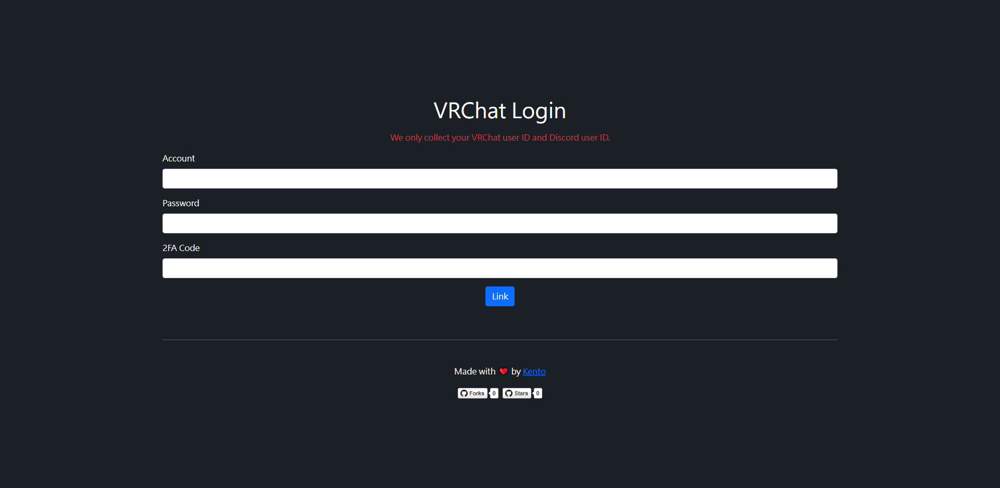
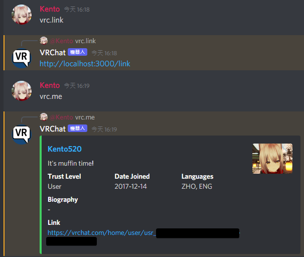
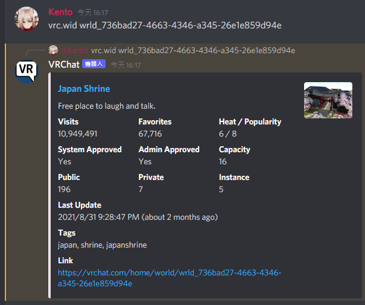

# VRChat Discord Bot
Discord bot for VRChat community.

## Invite Link
- [Click here to add bot to your server.](https://discord.com/oauth2/authorize?client_id=902091687663378433&permissions=8&scope=bot%20applications.commands)

## Setup
- [Create a Disord application](https://discord.com/developers/applications)
- Install [Node.js >= 17.0.0](https://nodejs.org/en/), [Yarn](https://yarnpkg.com/) and [MongoDB](https://www.mongodb.com/)
- Clone the repo.
- Duplicate `.env.sample` file, rename it to `.env` and edit it.
- Run `yarn` to install dependencies.
- Run `yarn start` to start the bot.
- Set Discord application OAuth2 redirect URL to your host URL.

## Avaliable Commands
- `vrc.help` - Display help infomations.
- `vrc.uid usr_xxxxxxxx-xxxx-xxxx-xxxx-xxxxxxxxxxxx` - Search user by user ID.
- `vrc.user xxx` - Search 60 users by display name.
- `vrc.wid wrld_xxxxxxxx-xxxx-xxxx-xxxx-xxxxxxxxxxxx` - Search world by world ID.
- `vrc.world xxx` - Search 60 worlds by name.
- `vrc.link` - Link your VRChat ID and Discord ID.
- `vrc.me` - Show your VRChat profile.
- `vrc.profile @xxx` - Show mentioned user's VRChat profile.

## Screenshots

